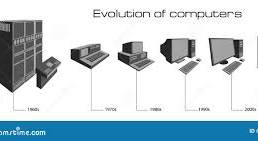

# История развития компьютеров

## Введение
Компьютеры прошли долгий путь развития - от механических устройств до современных ноутбуков.

## Основные этапы

### 1. Первые компьютеры (1940-1950 годы)
- ENIAC - первый электронный компьютер
- Занимал целую комнату
- Использовался для военных расчетов

### 2. Персональные компьютеры (1980-е годы)
- Появление IBM PC
- Компьютеры стали доступны для дома
- Развитие операционных систем

### 3. Современная эпоха
- Ноутбуки и планшеты
- Облачные технологии
- Искусственный интеллект

## Заключение
Компьютеры продолжают развиваться и становятся все более важной частью нашей жизни.

